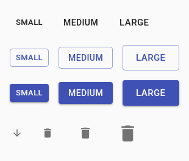

- Start Date: 2020-03-31

# Table of contents

- [Table of contents](#table-of-contents)
- [Summary](#summary)
- [Motivation](#motivation)
  - [Visual Comparison testing](#visual-comparison-testing)
  - [Reformatting of component stories for testing](#reformatting-of-component-stories-for-testing)
- [Detailed design](#detailed-design)
  - [Test stories](#test-stories)
  - [Test feature files](#test-feature-files)
- [Drawbacks](#drawbacks)
- [Alternatives](#alternatives)
- [Adoption strategy](#adoption-strategy)
- [How we teach this](#how-we-teach-this)
- [Unresolved questions](#unresolved-questions)

# Summary

The Carbon team would like to use a more rapid and accurate method of regression testing Carbon components to reduce development to release time and enable the regression suite to be run at every commit.

# Motivation

The regression suite uses the Cypress.io framework to test all knob configurations, events and accessibility of all stories of all components in Storybook. In its current form it takes around 3.5 hours to run. When the build itself only takes around 7 minutes, it is disproportionate to have a regression suite for those same components to take that much longer to run by such a huge factor. We require a method by which the visual UI can be tested rapidly, accurately and at every commit to detect regressions earlier.

## Visual Comparison testing
Making assertions of values in the CSS is not the most reliable way to verify the visual styling of the components is correct. In addition, this has been found to be brittle in cases such as where browser upgrades slightly amend the number of pixels of component dimensions and the test spec is asserting on specific pixel values.

The visual comparison testing tool ‘Applitools’ has been under test for some time. It is probably the most mature of this type of tool and is endorsed by prominent members of the testing community. Snapshots of the required screen or frame are taken and compared with baseline snapshots. Any differences that can be detected with the human eye are highlighted as test failures. While we are only currently primarily concerned with testing the components in Chrome, we do have the option with Applitools to render the snapshots of the DOM in almost any other operating system, browser, device and viewport configuration we like by using their Ultrafast Grid. This would give us an early indication of any styling issues with the components in other set ups.

Recently, we have carried out some proof of concept testing of the Carbon components by integrating Applitools with our existing Cypress regression suite. While we can see that this would be a more accurate way of testing the visual attributes of the components, this activity has highlighted that in its current form, the regression suite with Applitools integration is not a viable option as the vast number of comparisons extend an already lengthy suite.

## Reformatting of component stories for testing
By presenting the various different pre-set configurations of the components in as few frames and stories as possible without the need to set knobs, the tests could run faster while Applitools could take and compare a vastly reduced number of snapshots. The purpose of our Carbon component library is to showcase to Developers how they can create a beautiful UI in a fast and easy manner with our components, not how to amend knobs in Storybook.

# Detailed design

To facilitate a change to this method of regression testing, the components need to be presented differently in Storybook with all possible configurations pre-set in the stories and no knobs to amend. This has already been done to some extent for some components e.g. Button in the `Design System` directory. If all of the configurations and scenarios can be demonstrated in stories in the `Design System` directory then they should, with regression testing run against those stories. Any additional cases, such as edge cases or extended test cases e.g. tests for special characters in labels, should be added in a story in the `Test` directory therefore using the `Test` directory purely for cases for extended testing only.

## Test stories
The stories in Storybook should be minimal with as many configurations of the components as is sensibly possible presented in one frame to reduce the number of snapshots taken by Applitools. An example of a similar method being used for regression testing elsewhere in the industry is in the Material-UI component library which uses Argos rather than Applitools, some results of which can be found here: https://www.argos-ci.com/mui-org/material-ui/builds/294. Taking their Button component snapshot result as an example, their various size configs for primary, secondary, tertiary and icon button types are presented in one shot:

In this example alone, 13 test cases in our current regression suite could be reduced to just 1 snapshot from Applitools.

## Test feature files
Cypress will use the feature files to navigate to each story, as it does currently, but without setting all the configuration via the knobs. A step will be added for Applitools to snapshot the canvas. This will remove the need for the numerous steps taken just to get the component into the pre-requisite state on which to assert. The regression suite could be reduced to one Cypress test file for each component. Any differences between this and the baseline snapshot would comprise a test failure.

The test feature file for Button could be reduced to something like:

Feature: Button component
  I want to check Button component properties

  Background: Open Button component default page
    Given I open "Button" component page

  Scenario: Verify Button is presented correctly
    # commented because of BDD default scenario Given - When - Then
    # When I open "Button" component page
    Then Button is presented correctly

  Scenario: Verify the click function for a Button component
    Given clear all actions in Actions Tab
    When I click on "button"
    Then click action was called in Actions Tab

The step “Then Button is presented correctly” is where Applitools will take the snapshot. The existing accessibility and build test feature files could remain as they are.

During initial proof of concept testing of Applitools in 2019, some basic tests were executed using Cypress to navigate to some component URLs and for Applitools to take a snapshot. The typical total time for Applitools to snapshot one component, render the DOM in 10 different configurations and return the results was around 50 seconds, so if we just wanted to snapshot 1 URL and compare in 1 config this should take around 5 seconds per story. There are currently around 150 stories (plus 18 for deprecated components although these will disappear at some point). This would take an estimated 12.5 minutes to run in the proposed set up. For some components, more stories may be required and also more components will be created adding to the numbers but for many the number of stories could be reduced to 1. The estimated time to capture and compare snapshots will be around these 12.5 minutes of estimated time.

# Drawbacks

Introducing another tool to the framework to highlight regressions at every commit requires upskilling and familiarisation for the whole team.

We could encounter many false positives due to the library changing intentionally, which will require investigation of the failures and accepting the new baseline snapshots where required. This will rely on the whole team taking responsibility when their commit has caused a regression test failure, not just QA Engineers although this could be seen as a benefit.

We will need to rewrite the test specs removing much of the content leaving mainly the Applitools and events steps. This will be time consuming. Many months have been invested in writing the current regression suite so it may seem like wasted time and labour.

Using visual comparison testing only for regression testing would seem to be solely testing the look and feel of the components, not the functionality. However, the unit tests are testing all the functionality in most cases. Any gaps in functionality tests can be added to the unit tests or, where required, as additional stories in the Test directory.

With some components requiring more stories, this could also result in the components appearing cluttered in the library. Similarly, the preview pane could appear cluttered by having many configurations in one frame. The stories and frames will have to be designed well to ensure this is not the perception.

By having configurations set up already in the stories it removes a lot of the flexibility of testing. The story code would need to be amended to change the state of various props if the required configurations are not already present in the stories. Without the knobs being visible, it may not be immediately clear to a QA Engineer which props the component has which can be amended and thus if all changes to these have been adequately demonstrated. QA Engineers would need to become more technical to enable more detailed examination and understanding of the stories code, although this could be seen as a benefit and is indeed the trend in the frontend testing world.

# Alternatives

There is some duplication between the Cypress regression tests and the unit tests. Indeed, the act of setting knobs to various states to set a prerequisite state and the result asserted on is already done in many of the unit tests. An exercise to remove duplicate tests in the regression suite could be carried out. The recent removal of support of the ‘classic’ theme and related feature files reduced the regression suite run time by 1-1.5 hours. We could upgrade our Cypress package to a paid for service which would allow the tests to be parallelised rather than them all running in one thread, reducing the run time further. All of these actions though would not reduce the regression suite run time by the required factor nor provide the visual comparison testing capability that Applitools integration would.

One advantage of integrating Applitools is having the option of rendering the DOM snapshots in many other operating system, browser, device and viewport configurations we like by using their Ultrafast Grid. This does not mean though that we are testing our components in these other configurations at the time of test execution. There are other vendors, including CrossBrowserTesting and BrowserStack, which would allow us to run our required tests directly in these other configurations of real machines. However, this would mean a change of automation framework from Cypress to Selenium. This seems like a drastic change at this point as all the files, including the support files like helper files, indexes, locators etc, would need rewriting. In addition, not all of these other products are free for open source repositories as Applitools is and don’t all provide a dashboard which is as user-friendly as that of Applitools.

# Adoption strategy

Developers would need to amend how they write the stories. As many examples as possible of various main configurations of the components will need to be included in one story without any knobs. Other React libraries such as Material-UI (https://material-ui.com) use this method of demonstrating their components. The current standard of documentation in the `Docs` tab will need to be maintained to provide a thorough description of how the component is meant to be used.

QA Engineers will amend existing specs to leave just the steps to capture snapshots with Applitools. QA Engineers will need to identify additional scenarios and use cases not included in the main `Design System` directory as currently. These would be added to the `Test` directory, although it would be beneficial if QA Engineers were able to add these themselves with the help of Developers if required.

Applitools can integrate with Jira and automatically log a defect when a test has failed which could be useful and save time with manual intervention, although initial investigation into whether the failure is a valid one should probably be done first so this may not be a feature we could adopt immediately.

# How we teach this

The Testing Strategy `README.md` would be updated with details of this new process. As creating the automation tests now form part of the definition of done for any new components, Developers may need some assistance with understanding how to write the new format of Cypress tests. Support documentation for Applitools is available from https://applitools.com to help with Cypress integration and GitHub. Assistance can also be provided by the Automation Team who have been undertaking the most recent phase of Applitools integration testing with Cypress.

# Unresolved questions

How long will the regression suite take to run with this proposed set up? Until we trial this with a varied selection of components, a more accurate estimate will not be known. However, it is likely to be of the order of a number of minutes rather than hours.
